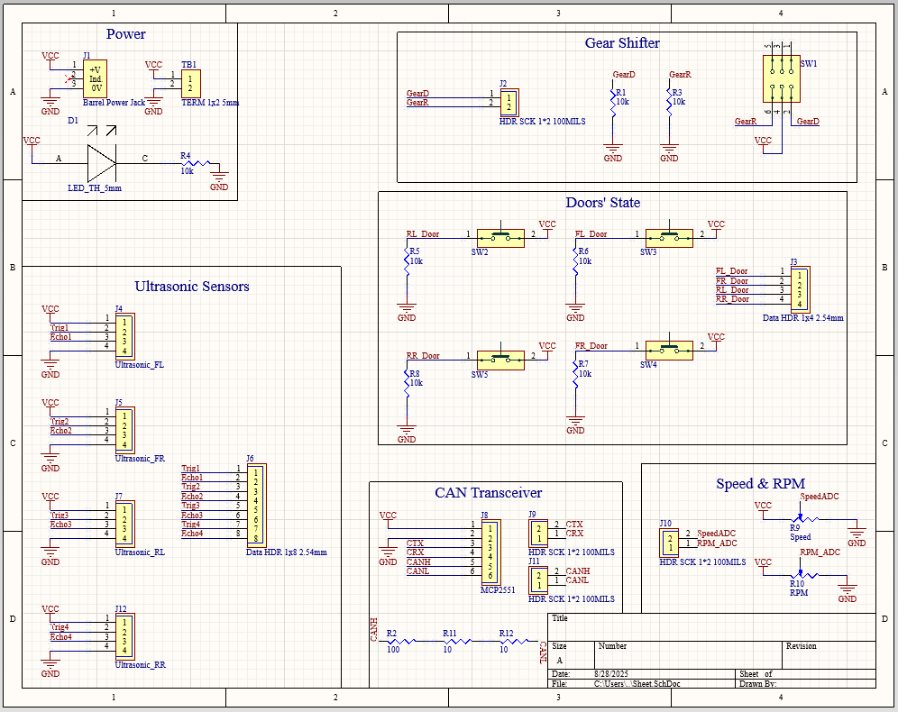
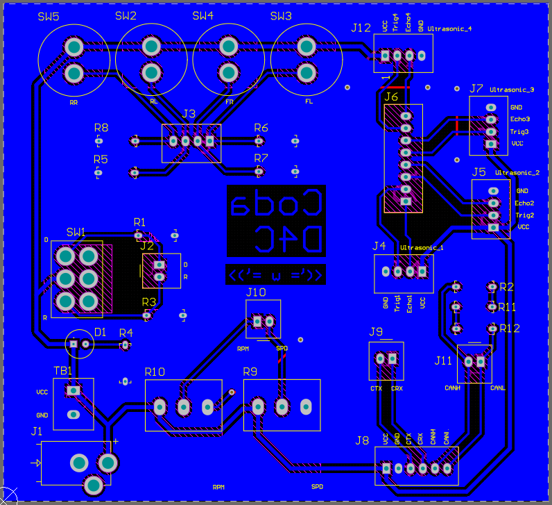
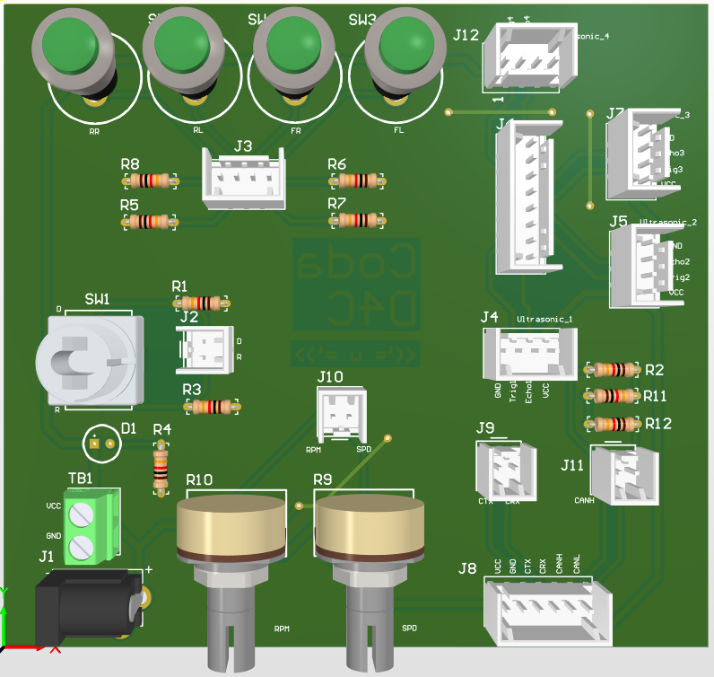

# NXP-Expansion-Board

## About
This is a PCB designed on Altium to collect all the hardware components needed for the NXP firmware to function as intended in Coda. Nothing fancy here. Also, shout out to my boi [Ahmed Sherif](https://github.com/Ahmed0Sherif) for acting as my design consultant with this one. :)

## Output

